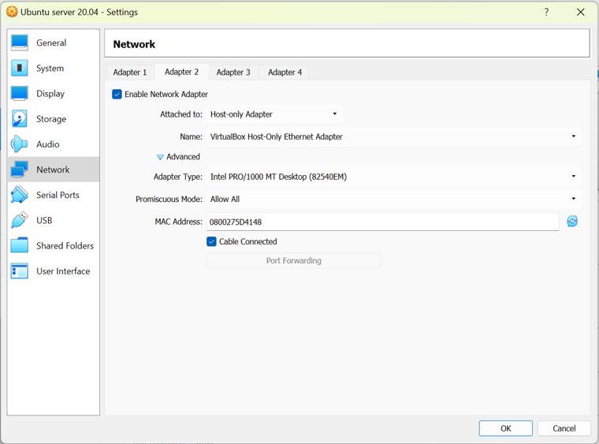
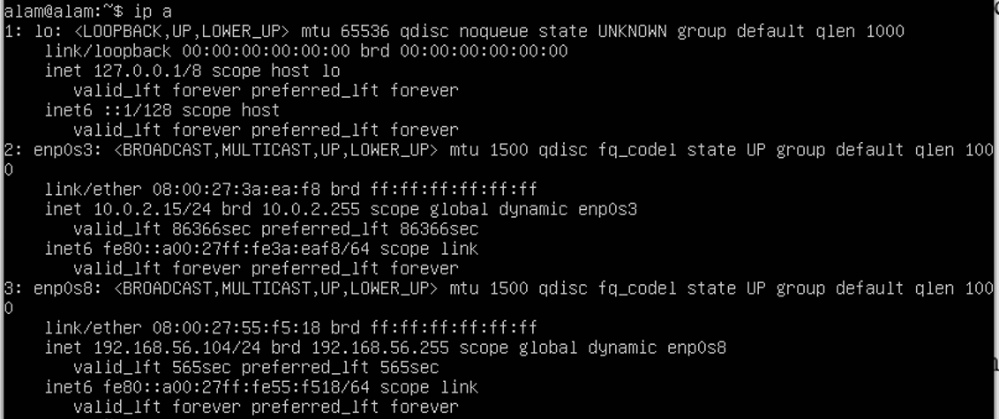

# Ubuntu Server Installation

## Practical Objectives

1.  Students are able to install Ubuntu Server.

2.  Students understand and are able to practice basic commands in the Ubuntu Server environment.

## Theoretical Background of Ubuntu Server

Ubuntu Server is a Linux-based server operating system based on the Ubuntu distribution, developed by Canonical Ltd. Ubuntu Server is specifically designed for use in server environments and network infrastructure. Ubuntu Server is the version of the Ubuntu operating system without a graphical user interface (headless), with a primary focus on performance and efficiency for server-related tasks.

The following are some important points about Ubuntu Server:

1.  Open Source: Ubuntu Server is open-source, meaning that its source code can be freely accessed, used, modified, and distributed by anyone. As a result, many communities and organizations can contribute to the development and improvement of the operating system.

2.  Stability and Security: Ubuntu Server is supported by a large and active community and is reviewed by security experts. Stable versions are released regularly with Long-Term Support (LTS), providing security updates and bug fixes for an extended period, typically up to five years after release.

3.  APT Package Management: Like other Linux operating systems, Ubuntu Server uses the Advanced Package Tool (APT) as its package management system. This allows administrators to easily install, remove, and manage software and additional packages required by the server system.

4.  Command-Line Interface (CLI): Ubuntu Server operates through a CLI, allowing administrators to manage the system remotely or through Secure Shell (SSH). The absence of a graphical interface helps reduce resource usage and improve security.

5.  Cloud Support: Ubuntu Server is well known for its support for cloud computing environments. This server version is widely used by cloud service providers such as Amazon Web Services (AWS), Google Cloud Platform (GCP), and Microsoft Azure.

6.  Virtualization Support: Ubuntu Server supports virtualization technologies such as Kernel-based Virtual Machine (KVM) and Docker containers. This allows users to create and manage virtual machines and containers easily and efficiently.

7.  Access to Ubuntu Repositories: Ubuntu Server provides access to extensive Ubuntu repositories for downloading and installing various server software, including web applications, databases, email servers, and many others.

8.  Documentation and Community Support: Ubuntu has a large and active community that can provide assistance through forums, discussion groups, and other online resources. In addition, paid support options are available from Canonical Ltd. for business and enterprise users.

Ubuntu Server has become a popular choice for building and managing server infrastructure due to its stability, security, and support for modern technologies such as cloud computing and virtualization. It provides powerful tools for operating servers reliably and efficiently. The hands-on steps for installing and configuring it are covered in @sec-steps.

## Ubuntu Server Practicum Steps {#sec-steps}

This guide walks through installing Ubuntu Server in VirtualBox and configuring its network adapter so the machine can be reached from outside VirtualBox.

### Installing Ubuntu Server in VirtualBox

::: {.callout-note title="What you'll need"}
An internet connection is required during installation, since packages are fetched while Ubuntu Server sets itself up.
:::

1.  **Download the Ubuntu Server installer image** from [ubuntu.com/download/server](https://ubuntu.com/download/server).

    Choose the version that matches your computer's specifications. **Ubuntu Server 24** is the recommended version for this practicum.

2.  **Install Ubuntu Server through VirtualBox.**

    ::: {.callout-important title="Recommended virtual machine specifications"}
    | Setting       | Recommended value |
    |---------------|-------------------|
    | Base Memory   | 8 GB              |
    | Processors    | 2                 |
    | Storage (VDI) | 30 GB             |

    Use a **different drive** from the one hosting your host operating system to store the VM folder!
    :::

### Configuring the Network Adapter for External Access

The default network adapter in VirtualBox is isolated from the outside world. Adding a second, host-only adapter lets you reach the Ubuntu Server VM from your host machine, configured as shown in @fig-vmware_ii.

{#fig-vmware_ii fig-align="center" width="80%"}

::: {.callout-tip title="Before you start"}
Power off the Ubuntu Server VM you just installed before changing its network settings.
:::

1.  **Enable a host-only adapter.**

    In the VM's **Settings**, open the **Network** menu and select the **Adapter 2** tab. Then:

    -   Set **Attached to:** → `Host-only Adapter`
    -   Set **Promiscuous Mode:** → `Allow All`

2.  **Power the VM back on** and edit the Netplan configuration.

    Create a configuration file with:

    ``` bash
    sudo nano /etc/netplan/01-netconf.yaml
    ```

    Add the following content to the file:

    ``` yaml
    network:
      version: 2
      renderer: networkd
      ethernets:
        enp0s8:
          dhcp4: yes
    ```

    Save and exit the editor by pressing <kbd>Ctrl</kbd>+<kbd>X</kbd>, then <kbd>Y</kbd>, then <kbd>Enter</kbd>.

3.  **Apply the new network configuration.**

    In the Ubuntu Server terminal, run:

    ``` bash
    sudo netplan apply
    ```

4.  **Verify the IP address.**

    Check that Ubuntu Server has received an IP address on the `enp0s8` adapter. You can confirm this with:

    ``` bash
    ip a
    ```

    ::: {.callout-note title="Example result"}
    In the example used for this guide, the Ubuntu Server IP address to be used in the next parts of the practicum is:

    > **192.168.56.104**
    :::

    @fig-ubuntuserver shows an example of this output in the Ubuntu Server terminal.

    {#fig-ubuntuserver fig-align="center" width="100%"}

------------------------------------------------------------------------

::: {.callout-warning title="Keep this address handy"}
The IP address obtained on the `enp0s8` adapter (e.g. `192.168.56.104`) will be used to access this Ubuntu Server instance in later steps of the practicum. Write it down before continuing.
:::

### Exercise

Try the commands listed in @tbl-linuxcommand, explain their functions, and provide screenshots of your results. Complete a total of 15 commands.

| # | Command | # | Command | # | Command | # | Command |
|---|---------|---|---------|---|---------|---|---------|
| 1 | `ls` | 22 | `ifconfig` | 43 | `lsof` | 64 | `parted` |
| 2 | `pwd` | 23 | `ip` | 44 | `dig` | 65 | `wc` |
| 3 | `cd` | 24 | `wget` | 45 | `nslookup` | 66 | `ls` |
| 4 | `clear` | 25 | `curl` | 46 | `du` | 67 | `nmap` |
| 5 | `mkdir` | 26 | `apt` | 47 | `tree` | 68 | `dmesg` |
| 6 | `mv` | 27 | `apt-get` | 48 | `ss` | 69 | `chattr` |
| 7 | `cp` | 28 | `yum` | 49 | `partx` | 70 | `usermod` |
| 8 | `rmdir` | 29 | `dnf` | 50 | `uptime` | 71 | `free` |
| 9 | `touch` | 30 | `rpm` | 51 | `tr` | 72 | `cron` |
| 10 | `cat` | 31 | `alias` | 52 | `ping` | 73 | `mysql` |
| 11 | `echo` | 32 | `dd` | 53 | `zcat` | 74 | `sdiff` |
| 12 | `less` | 33 | `top` | 54 | `xargs` | 75 | `history` |
| 13 | `tar` | 34 | `useradd` | 55 | `rm` | 76 | `netstat` |
| 14 | `grep` | 35 | `sleep` | 56 | `stat` | 77 | `sftp` |
| 15 | `head` | 36 | `screen` | 57 | `who` | 78 | `tcpdump` |
| 16 | `tail` | 37 | `pv` | 58 | `locate` | 79 | `scp` |
| 17 | `sort` | 38 | `fgrep` | 59 | `host` | 80 | `rsync` |
| 18 | `ps` | 39 | `dir` | 60 | `find` | 81 | `fsck` |
| 19 | `kill` | 40 | `egrep` | 61 | `fuser` | 82 | `bc` |
| 20 | `df` | 41 | `ssh` | 62 | `at` | 83 | `chage` |
| 21 | `chown` | 42 | `fd` | 63 | `fdisk` | 84 | `ffmpeg` |

: Essential Linux Commands {#tbl-linuxcommand}