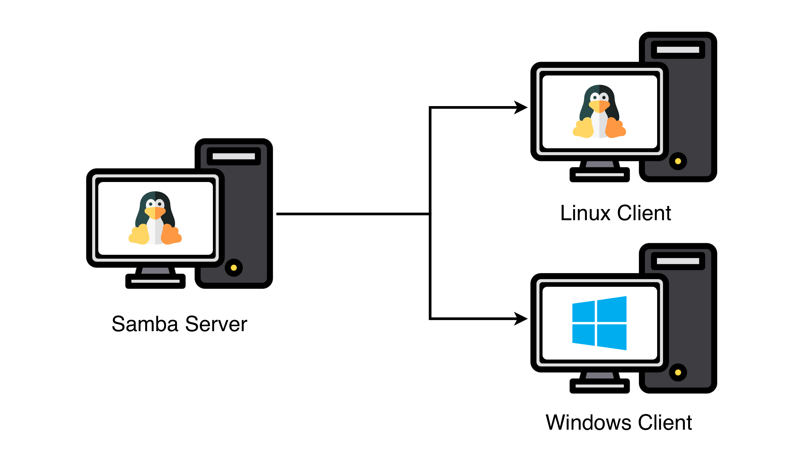
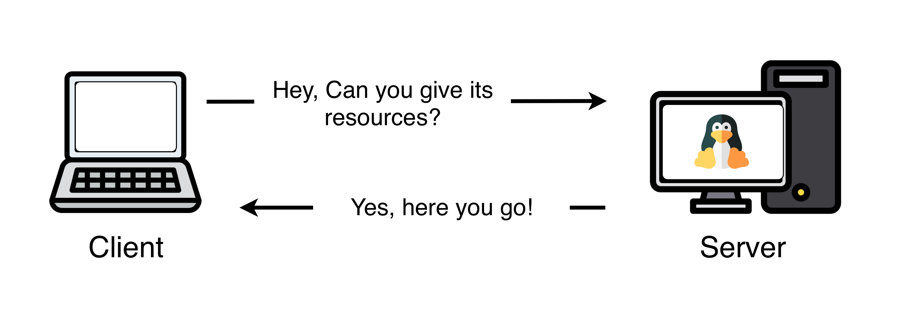
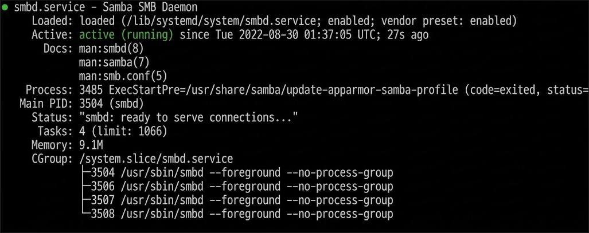
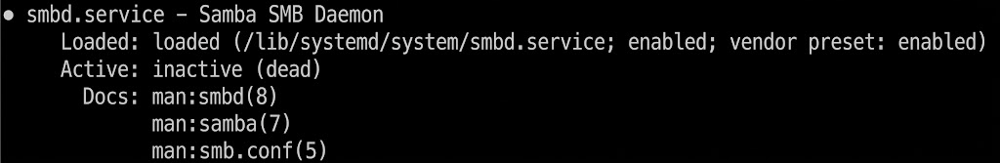
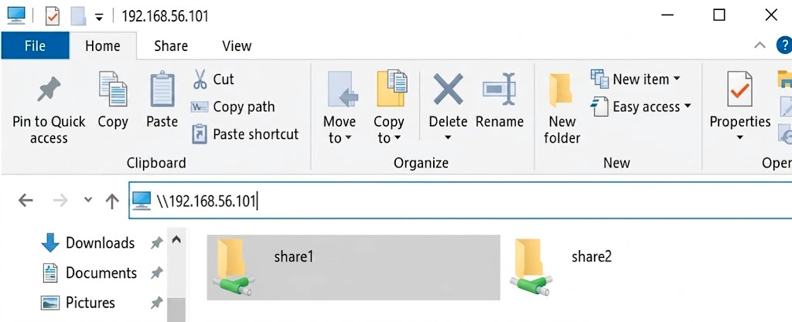

# Samba Server

## Practical Objectives

a.  Students are able to install Samba Server.

b.  Students are able to modify Samba configuration to manage user access rights and shared resources.

c.  Students are able to practice file sharing between Ubuntu and Windows using Samba.

## Theoretical Background of Samba Server {#sec-samba_theory}

Samba is a free and open-source software that provides an implementation of the SMB/CIFS protocol for non-Windows operating systems such as Linux, Unix, and macOS [@samba_what_is]. A Samba server allows these operating systems to function as a file and print server in a Windows network environment, enabling Windows users to share and access files and printers from computers running non-Windows operating systems, as illustrated in @fig-samba-overview. Samba provides features such as authentication, authorization, encryption, and access rights management to ensure the security and privacy of shared data. It can also be integrated with directory services such as Active Directory to simplify user management in large network environments [@samba_intro].

{#fig-samba-overview .lightbox fig-align="center" width="80%"}

Samba operates using Server Message Block (SMB) protocol — a network protocol used to share files, printers, and other network resources between Windows or Unix computers [@microsoft_smb_cifs]. SMB was originally developed by Microsoft as part of LAN Manager in the 1980s and has since become the de facto standard for file and printer sharing in Windows networks. SMB is a client-server protocol: the client sends requests to the server, and the server responds by delivering data or performing the requested operation, as illustrated in @fig-client-server. Data exchange is secured using encryption, authentication, and authorization.

{#fig-client-server .lightbox fig-align="center" width="80%"}

Samba consists of two programs running in the background:

-   **SMBD** — the file server; spawns a new process for each active client.
-   **NMBD** — converts NetBIOS computer names to IP addresses and monitors shared resources on the network.

SMBD behavior is controlled through `/etc/samba/smb.conf` [@samba_smb_conf]. Samba can be configured as a file server, print server, or domain controller.

------------------------------------------------------------------------

::: {.callout-note title="Uses of Samba Server" icon="false"}
-   Share one or more directory trees across the network.
-   Centrally manage printers, print settings, and drivers for Windows clients.
-   Assist clients with network browsing.
-   Authenticate clients logging in to a Windows domain.
:::

::: {.callout-note title="Advantages of Samba" icon="false"}
-   Free and open-source — no licensing cost.
-   Available on multiple platforms for file sharing services.
-   Easy to configure and administer.
-   Connects directly to the network with minimal issues.
-   Highly reliable — errors are uncommon unless the server has hardware problems.
:::

::: {.callout-note title="Key Features of Samba" icon="false"}
1.  **User Authentication** — Users must log in before accessing Samba services. Samba accounts are managed with `smbpasswd`.
2.  **Write Access Control** — Write permissions can be set per-share using `read only` or `writable` directives.
3.  **Network Access Control** — Access can be restricted by allowing or blocking specific IP addresses.
:::

## Samba Server Installation {#sec-steps}

::: {.callout-important title="Before you begin"}
These steps assume Ubuntu Server is already installed and running. If not, complete the Ubuntu Server installation on @sec-ubuntuserver.
:::

:::: panel-tabset
## 1. Installation

**Step 1 — Log in as root**

Log in to your Ubuntu Server terminal as root (or prefix each command with `sudo`).

**Step 2 — Update the package list**

``` bash
apt update
```

**Step 3 — Install Samba**

``` bash
apt install samba  # <1>
```

1.  An active internet connection is required — packages are downloaded during installation.

Continue the installation until complete.

**Step 4 — Verify the installation**

``` bash
systemctl status smbd  # <1>
```

1.  `smbd` is the main Samba file-server daemon. A status of `active (running)` confirms a successful install.

If successful, the output will show **`active (running)`**, as shown in @fig-smbd-active.

{#fig-smbd-active .lightbox fig-align="center" width="80%"}

If the status shows **`inactive (dead)`** (@fig-smbd-inactive), try starting Samba manually:

``` bash
service smbd start
```

If it still does not start, reinstall Samba.

{#fig-smbd-inactive .lightbox fig-align="center" width="80%"}

## 2. Firewall Setup

**Step 5 — Check firewall status**

``` bash
ufw status
```

If the firewall is not active, enable it first:

``` bash
ufw enable
```

**Allow Samba traffic through the firewall**

``` bash
ufw allow Samba  # <1>
```

1.  This opens UDP ports 137–138 and TCP ports 139 and 445, which Samba needs to communicate with Windows clients.

::: {.callout-warning title="Do not skip this step"}
Without allowing Samba through the firewall, Windows clients will not be able to connect to the shared folders.
:::
::::

## Exercise {#sec-exercise}

### Setting Up File Sharing

**Step 1 — Create the shared directories**

``` bash
mkdir /home/share1   # <1>
mkdir /home/share2
```

1.  Both directories will be the root of each Samba share.

Create an empty test file inside each directory:

``` bash
touch /home/share1/testfile1.txt
touch /home/share2/testfile2.txt
```

**Step 2 — Set directory permissions**

``` bash
chmod 777 /home/share1  # <1>
chmod 777 /home/share2
```

1.  `777` grants read, write, and execute permission to all users. For production use, more restrictive permissions are recommended.

**Step 3 — Create Samba users**

``` bash
useradd user1  # <1>
useradd user2
```

1.  This creates a Linux system user. A separate Samba password is still required in the next step. 
**Step 4 — Set Samba passwords**

``` bash
smbpasswd -a user1  # <1>
```

1.  The `-a` flag adds a new Samba user. Enter the password twice when prompted.

Repeat for `user2`:

``` bash
smbpasswd -a user2
```

**Step 5 — Configure access rights in `smb.conf`**

Open the Samba configuration file:

``` bash
nano /etc/samba/smb.conf
```

Scroll to the bottom and add the following blocks:

``` ini
[share1]
path = /home/share1       # <1>
valid users = user1, user2  # <2>
read list = user2           # <3>
write list = user1          # <4>
browseable = yes

[share2]
path = /home/share2
valid users = user1, user2
read list = user1
write list = user2
browseable = yes
```

1.  The directory on the server that will be shared.
2.  Only these users may connect to this share.
3.  `user2` can only read files in `share1`.
4.  `user1` can read and write files in `share1`.


Save and exit by pressing <kbd>Ctrl</kbd>+<kbd>X</kbd>, then <kbd>Y</kbd>, then <kbd>Enter</kbd>.

| Folder |    user1     |    user2     |
|--------|:------------:|:------------:|
| share1 | Read + Write |  Read only   |
| share2 |  Read only   | Read + Write |

**Step 6 — Restart Samba**

``` bash
systemctl restart smbd  # <1>
```

1.  Configuration changes only take effect after a restart.

### Testing File Sharing from Windows

**Step 1 — Find the Ubuntu Server IP address**

``` bash
ip a  # <1>
```

1.  Look for the IP address on the `enp0s8` adapter (the host-only adapter configured earlier).

Note the IP address (e.g., `192.168.56.101`).

**Step 2 — Open the shares in File Explorer**

On your Windows machine, open **File Explorer** and type the following in the address bar:

```         
\\192.168.56.101
```

Confirm that both `share1` and `share2` are visible, as shown in @fig-windows-shares.

{#fig-windows-shares .lightbox fig-align="center" width="80%"}

**Step 3 — Test access as `user1`**

Click `share1` and log in as `user1` when prompted. Check each of the following:

-   Can you view the contents of `share1`?
-   Can you create a new file inside `share1`?
-   Can you copy a file from `share1` to local Windows storage?

Then navigate to `share2` (still logged in as `user1`) and repeat the same checks.

::: {.callout-tip title="Expected result for user1" collapse="true"}
-   **share1** → can view, create, and copy files ✓
-   **share2** → can view and copy files, but **cannot** create or modify files ✗
:::

**Step 4 — Disconnect and switch to `user2`**

Open **Command Prompt** on Windows and check the active connection:

``` cmd
net use
```

Disconnect it (replace `\\name` with the connection name shown above):

``` cmd
net use \\name /delete  # <1>
```

1.  Disconnecting is necessary — Windows caches credentials, so the old session must be cleared before logging in as a different user.

**Step 5 — Test access as `user2`**

Connect again to `\\192.168.56.101`, log in as `user2`, and check both `share1` and `share2`.

::: {.callout-tip title="Expected result for user2" collapse="true"}
-   **share1** → can view and copy files, but **cannot** create or modify files ✗
-   **share2** → can view, create, and copy files ✓
:::