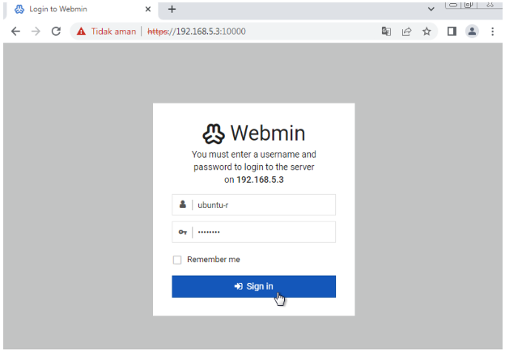

# Webmin
 
## Practical Objectives
 
a.  Students are able to install Webmin on Ubuntu Server.
b.  Students are able to use Webmin features to perform system administration and network management tasks.
 
## Theoretical Background {#sec-theory-webmin}
 
Webmin is an open-source, web-based administration interface for Linux and Unix systems, developed by Jamie Cameron [@cameron_webmin]. Rather than requiring administrators to memorise shell commands, Webmin provides a graphical interface accessible from any web browser — making system management more approachable for users who are not yet fluent with the Linux terminal.
 
::: {.callout-warning title="A note on system administration" icon=false}
Webmin makes powerful operations easy to trigger. Always make sure you understand what an action does before applying it — mistakes in system configuration can be difficult to reverse and may affect server stability.
:::
 
Webmin's capabilities are organised into modules. The core modules cover the following areas:
 
| Module area | What you can do |
|---|---|
| **User & Group Management** | Add, edit, and delete user accounts and groups; manage permissions and access rights |
| **Service Management** | Start, stop, restart, and configure services such as Apache, MySQL, and SSH |
| **Network Configuration** | Set IP addresses, manage network interfaces, and adjust network settings |
| **Package Management** | Install, remove, and update software packages through a web interface |
| **Disk & File Management** | Manage disk partitions, storage allocation, and file system operations |
| **Security Configuration** | Set file permissions, configure the firewall, and apply other security measures |
 
: Webmin core module areas {tbl-colwidths="[30,70]"}
 
Webmin supports a wide range of Linux distributions and can be extended further through community-developed modules that add support for additional applications and configurations.
 
## Webmin Installation {#sec-steps-webmin}
 
Log in to Ubuntu Server as root, then follow the steps below.
 
**Step 1 — Download the repository setup script**
 
``` bash
curl -o webmin-setup-repo.sh https://raw.githubusercontent.com/webmin/webmin/master/webmin-setup-repo.sh
```
 
**Step 2 — Run the script to add the repository and GPG key**
 
``` bash
sudo sh webmin-setup-repo.sh  # <1>
```
1. This adds the official Webmin package repository and its signing key to the system, so the package can be installed and updated through `apt`.
 
**Step 3 — Update the package list**
 
``` bash
apt-get update
```
 
**Step 4 — Install Webmin**
 
``` bash
apt install webmin --install-recommends -y  # <1>
```
1. The `--install-recommends` flag installs optional but recommended packages that enable additional Webmin features.
 
**Step 5 — Open port 10000 in the firewall**
 
``` bash
ufw allow 10000/tcp  # <1>
```
1. Webmin listens on port **10000** over HTTPS. This rule allows incoming connections to that port.
 
## Exercise {#sec-exercise-webmin}
 
::: {.panel-tabset}
 
## Explore Webmin
 
**Step 1 — Access the Webmin dashboard**
 
From the Windows host machine, open a browser and navigate to:
 
```
https://192.168.56.103:10000
```
 
Replace `192.168.56.103` with your Ubuntu Server's IP address.
 
::: {.callout-note title="Security warning" icon=false}
If the browser displays a **Potential Security Risk Ahead** warning, click **Advanced** → **Accept the Risk and Continue**. This warning appears because Webmin uses a self-signed certificate, which browsers do not trust by default.
:::
 
**Step 2 — Log in**
 
Enter your Ubuntu Server's root username and password, then click **Sign In** as shown @fig-webmin-login.

{#fig-webmin-login .lightbox fig-align="center" width="60%"}
 
**Step 3 — Explore the dashboard**
 
Once logged in, observe the information displayed on the Webmin dashboard. Answer the following question:
 
> **Q:** What system information is shown on the dashboard? List the categories and describe what each one tells you about the server.
 
**Step 4 — Explore one feature in depth**
 
Navigate through the Webmin menu and choose **one feature** that you consider important. Answer:
 
> **Q:** Which feature did you select, under which menu does it appear, and what does it allow an administrator to do?
 
**Step 5 — Explore four more features**
 
Browse through the remaining menus and identify **four additional features** that you consider useful or interesting. For each one, state the feature name, its menu location, and its purpose.
 
**Step 6 — Test the reboot function**
 
Navigate to **System** → **Bootup and Shutdown**. Use the interface to reboot the Ubuntu Server. Confirm that the server comes back online and that Webmin is accessible again after the reboot.
 
## Add Account
 
Webmin has its own user system, separate from Linux system accounts. A Webmin user can be granted access to specific modules without having a full Linux login.
 
**Step 1 — Open the Webmin Users module**
 
In the Webmin menu, navigate to **Webmin** → **Webmin Users**.
 
**Step 2 — Create a new privileged user**
 
Click **Create a new privileged user**. Fill in the required fields:
 
-   **Username** — a login name for the new Webmin user
-   **Password** — set and confirm a password
-   **Modules** — select which Webmin modules this user can access
 
Click **Save** to create the account.
 
**Step 3 — Verify the new account**
 
Log out of Webmin, then log back in using the new account's credentials. Confirm that the user can only access the modules that were assigned.
 
:::