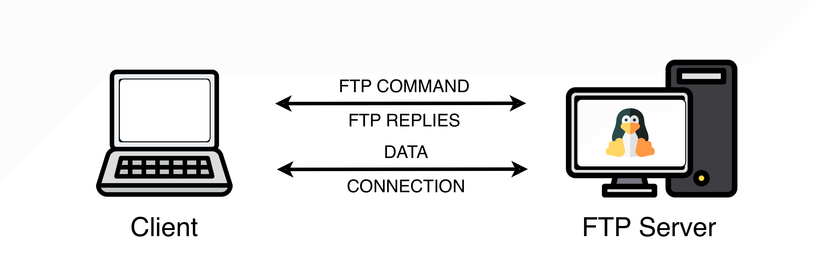
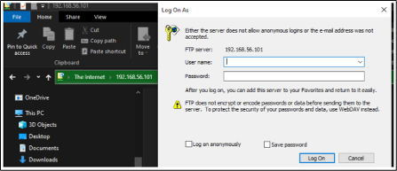
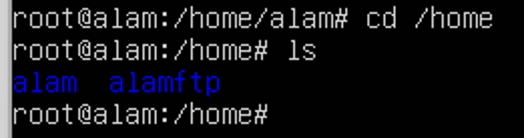

# FTP Server

## Practical Objectives

a.  Students are able to install an FTP Server on Ubuntu.
b.  Students are able to modify the FTP configuration to manage user access rights and shared resources.
c.  Students are able to practice file sharing and file transfer using FTP.

## Theoretical Background of FTP Server {#sec-theory-ftp}

FTP (File Transfer Protocol) is a standard communication protocol used to transfer files between a server and a client [@postel_ftp_1985]. FTP consists of two main components:

-   **FTP Server** — a program running on the server that provides access to the files stored on it.
-   **FTP Client** — a program running on the client computer, used to access files on the FTP server.

FTP uses a connection-based model, meaning a connection must be established before any data transfer can begin, as illustrated in @fig-client-server.

{#fig-client-server .lightbox fig-align="center" width="80%"}

There are two types of connection modes used in FTP:

-   **Active mode** — the FTP server opens a data connection to the client.
-   **Passive mode** — the client opens a data connection to the server. This mode is generally preferred when the client is behind a firewall or NAT.

::: {.callout-note title="FTP Variants" icon="false"}
-   **FTPS** — standard FTP extended with encryption, supporting Transport Layer Security (TLS) and Secure Sockets Layer (SSL).
-   **SFTP** — uses Secure Shell (SSH) as the underlying transport; not related to standard FTP despite the name.
-   **Trivial FTP (TFTP)** — the simplest variant, designed for lightweight file transfers to/from a remote server without authentication.
-   **Simple FTP** — complexity between TFTP and standard FTP; rarely used and largely obsolete.
:::

## FTP Server Installation {#sec-steps-ftp}

::: {.callout-important title="Before you begin"}
These steps assume Ubuntu Server is already installed and running. If not, complete the Ubuntu Server installation practicum first.
:::

:::: panel-tabset
## Installation

**Step 1 — Log in as root**

Log in to your Ubuntu Server terminal as root (or prefix each command with `sudo`).

**Step 2 — Update the package list**

``` bash
apt update
```

**Step 3 — Install vsftpd**

``` bash
apt install vsftpd  # <1>
```

1.  `vsftpd` (Very Secure FTP Daemon) is the FTP server package used in this practicum [@vsftpd]. Continue until the installation is complete.

**Step 4 — Verify the installation**

``` bash
systemctl status vsftpd  # <1>
```

1.  A status of `active (running)` confirms a successful installation.

If successful, the output will show **`active (running)`**.

## Firewall Setup

**Step 5 — Check the firewall status**

``` bash
ufw status
```

If the firewall is not active, enable it first:

``` bash
ufw enable
```

**Allow FTP traffic through the firewall**

``` bash
ufw allow ftp  # <1>
```

1.  This opens TCP port 21, which FTP uses for its control connection.

::: {.callout-warning title="Do not skip this step"}
Without allowing FTP through the firewall, Windows clients will not be able to connect to the FTP server.
:::

## Testing

**Step 6 — Test FTP access from Windows**

On your Windows machine, open **File Explorer** and type the server's IP address in the address bar, prefixed with `ftp://`:

```         
ftp://192.168.56.101
```

An FTP authentication window should appear, as shown in @fig-ftp-auth.

{#fig-ftp-auth .lightbox fig-align="center" width="70%"}
::::

## Exercise {#sec-exercise-ftp}

:::: panel-tabset
### 1. Creating an FTP User

**a. Add a new FTP user**

An FTP user owns the home directory that will be used as the FTP shared folder. Create the user before setting up the folder:

``` bash
adduser alamftp  # <1>
```

1.  Replace `alamftp` with any username you prefer.

Enter a password when prompted. For the subsequent fields (Room Number, etc.), press <kbd>Enter</kbd> to skip them.

**b. Restart the FTP service**

``` bash
systemctl restart vsftpd
```

**c. Test login from Windows**

Open **File Explorer** on Windows and navigate to `ftp://192.168.56.101`. Log in with the FTP user credentials you just created and confirm that the login succeeds.

::: {.callout-important title="Login fails?" collapse="true"}
If login is denied, the firewall may be blocking the connection. Temporarily disable it and try again:

``` bash
ufw disable
```
:::

### 2. Creating an FTP Folder

**a. Verify the user's home directory**

Confirm that a home folder for the FTP user was automatically created under `/home`:

``` bash
cd /home  # <1>
ls
```

1.  The FTP user's folder (e.g. `alamftp`) should appear in the listing on @fig-ftp-home.

{#fig-ftp-home .lightbox fig-align="center" width="50%"}

**b. Create a folder and a test file**

``` bash
mkdir /home/alamftp/folder_baru  # <1>
touch /home/alamftp/file_baru    # <2>
```

1.  Creates a new sub-folder inside the FTP user's home directory.
2.  Creates an empty test file for file transfer simulation.

**c. Verify in Windows File Explorer**

Refresh **File Explorer** on Windows and confirm that `folder_baru` and `file_baru` are now visible in the FTP share.

### 3. Blocking Users

FTP users can be blocked from accessing the server by adding their username to the FTP deny list.

**a. Open the FTP user block list**

``` bash
nano /etc/ftpusers  # <1>
```

1.  Any username listed in this file is denied FTP access.

**b. Add the username to block**

Scroll to the bottom of the file and add the username on a new line (e.g. `alamftp`). Save and exit by pressing <kbd>Ctrl</kbd>+<kbd>X</kbd>, then <kbd>Y</kbd>, then <kbd>Enter</kbd>.

**c. Test the blocked account**

Close and reopen **File Explorer** on Windows, then attempt to log in with the blocked user. Access should now be denied.

**d. Remove the block before continuing**

Open `/etc/ftpusers` again, delete the username you added, and save the file. The user must be unblocked before proceeding to the next exercise.

### 4. Granting Access

**a. Confirm that write access is not yet enabled**

In Windows **File Explorer**, try to copy a file into the FTP folder or delete an existing file. Confirm that the operation fails — write access is disabled in the default vsftpd configuration.

**b. Back up the configuration file**

``` bash
cp /etc/vsftpd.conf /etc/vsftpd.conf.backup  # <1>
```

1.  Always back up configuration files before editing them.

**c. Enable write access**

Open the configuration file:

``` bash
nano /etc/vsftpd.conf --linenumbers
```

Find **line 31** and uncomment it by removing the leading `#`:

``` ini
write_enable=YES
```

Save and exit.

**d. Restart the FTP server**

``` bash
systemctl restart vsftpd.service  # <1>
```

1.  Configuration changes only take effect after a restart.

**e. Verify write access from Windows**

In **File Explorer**, copy a file from your local computer into the FTP folder, and try deleting a file from the FTP folder. Both operations should now succeed.
::::