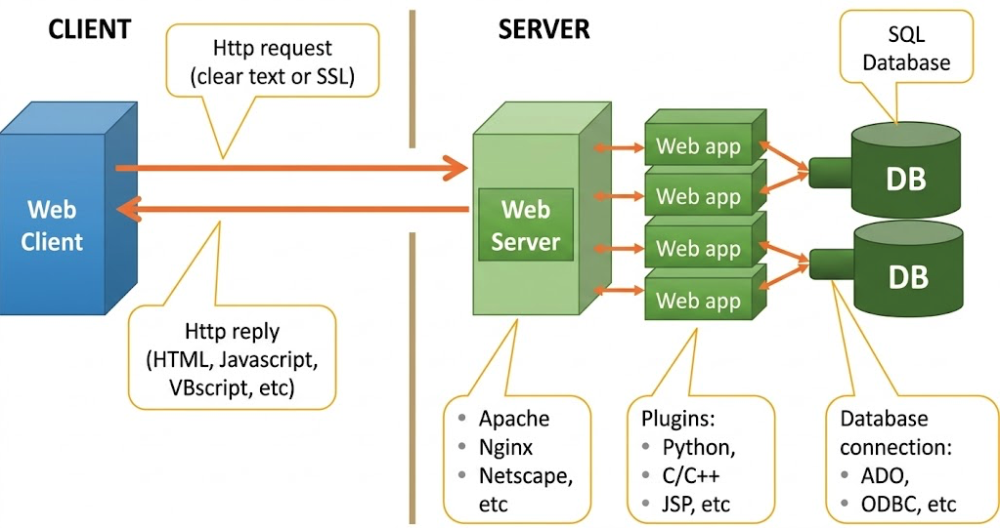

# Web Server
 
## Practical Objectives
 
a.  Students are able to install a Web Server.
b.  Students are able to configure the Web Server display using Virtual Hosting.
c.  Students are able to create and manage web page sub-folders.
 
## Theoretical Background of Web Server {#sec-theory-web}
 
A web server is a computer program that provides access to websites or web applications over the HTTP or HTTPS protocol [@apache_getting_started]. The web server stores and delivers files such as HTML, CSS, and images to clients that request access through a web browser or web application.
 
Beyond the web server itself, a web system consists of four main components: the **web server**, **web client**, **web application**, and **database**. The web client is the internet user accessing the web server's services, and the web application provides the software layer that supports those services, as illustrated in @fig-web-system.
 
{#fig-web-system .lightbox fig-align="center" width="80%"}
 
**HTTP** (HyperText Transfer Protocol) is the network protocol used to transfer data between a web server and a web client such as a browser [@mdn_http_overview]. HTTP follows a client-server model: the web client sends an HTTP request to the server, and the server returns an HTTP response. An HTTP response contains:
 
-   an **HTTP status code**, such as `200 OK` or `404 Not Found`,
-   **headers** carrying information about the server and the content,
-   the requested **content**, such as text or images.
 
::: {.callout-note title="HTTPS" icon=false}
HTTPS is the secure version of HTTP, enhanced with **SSL/TLS encryption** to protect data in transit between the client and the server.
:::
 
## Web Server Installation {#sec-steps-web}
 
::: {.callout-important title="Before you begin"}
These steps assume Ubuntu Server is already installed and running with network connectivity to a Windows host machine. If not, complete the Ubuntu Server installation practicum first.
:::
 
::: {.panel-tabset}
 
## 1.   Pre-checks
 
Run the following checks before installing Apache to confirm that no web server is currently running.
 
**Step 1 — Update the package list**
 
Log in to Ubuntu Server as root, then run:
 
``` bash
apt update
```
 
**Step 2 — Find the Ubuntu Server IP address**
 
``` bash
ip a  # <1>
```
1. Note the IP address on the `enp0s8` adapter (e.g. `192.168.56.103`).
 
**Step 3 — Ping from Windows**
 
On the Windows host, open **Command Prompt** and ping the Ubuntu Server IP address. A successful reply confirms network connectivity between the two machines.
 
**Step 4 — Confirm no web server is running (from Windows)**
 
If the ping succeeds, open a web browser on Windows and navigate to:
 
```
http://192.168.56.103
```
 
The expected result is an **Unable to connect** or **Connection timed out** message, confirming that no web server is currently active.
 
**Step 5 — Confirm no web server is running (from Ubuntu)**
 
If the Windows ping fails, verify from within Ubuntu Server instead:
 
``` bash
apt install w3m          # <1>
w3m -v http://192.168.56.103
```
1. `w3m` is a text-based web browser useful for testing web access directly from the terminal.
 
The expected output is: **No such file or directory**.
 
## 2.   Apache Installation
 
**Step 1 — Install Apache**
 
``` bash
apt install apache2  # <1>
```
1. Apache2 is one of the most widely used open-source web servers. An active internet connection is required during installation.
 
**Step 2 — Check Apache in the firewall app list**
 
``` bash
ufw app list  # <1>
```
1. Confirm that `Apache`, `Apache Full`, and `Apache Secure` appear in the list.
 
**Step 3 — Enable the firewall if inactive**
 
``` bash
ufw status   # <1>
ufw enable   # <2>
```
1. Check the current firewall status.
2. Run only if the status shows `inactive`.
 
**Step 4 — Allow Apache through the firewall**
 
``` bash
ufw allow 'Apache'  # <1>
ufw status
```
1. Grants Apache permission to receive incoming HTTP traffic on port 80.
 
## 3.   Verification
 
**Step 1 — Check that Apache is running**
 
``` bash
systemctl status apache2  # <1>
```
1. The output should show **`active (running)`** to confirm a successful installation.
 
**Step 2 — Access the Apache landing page**
 
From Windows, navigate to `http://192.168.56.103` in a browser — the default Apache landing page should now appear. Alternatively, from the Ubuntu terminal:
 
``` bash
w3m -v http://192.168.56.103
```
 
A page containing **"Apache2 Default Page"** content confirms the server is working correctly.
 
:::
 
## Exercise {#sec-exercise-web}
 
::: {.panel-tabset}
 
## 1.   Virtual Hosting
 
Virtual Hosting allows you to serve a custom website from your own directory instead of Apache's default root.
 
**Step 1 — Explore the default web root**
 
``` bash
cd /var/www  # <1>
ls
```
1. Apache's default content lives in `/var/www/html`. You will create a sibling directory for your own site.
 
**Step 2 — Create a directory and a sample page**
 
``` bash
mkdir /var/www/your_site_name
nano /var/www/your_site_name/index.html
```
 
**Step 3 — Edit `index.html`**
 
Type the following content into the editor:
 
``` html
<html>
  <head>
    <title>Welcome to Your Site Name!</title>
  </head>
  <body>
    <h1>Success! Your Virtual Host is working.</h1>
  </body>
</html>
```
 
Save and exit with <kbd>Ctrl</kbd>+<kbd>X</kbd>, then <kbd>Y</kbd>, then <kbd>Enter</kbd>.
 
**Step 4 — Update the Apache configuration**
 
Open the default virtual host configuration file:
 
``` bash
nano /etc/apache2/sites-available/000-default.conf
```
 
Find the `DocumentRoot` line, comment it out, and add a new line pointing to your directory:
 
``` apache
# DocumentRoot /var/www/html
DocumentRoot /var/www/your_site_name
```
 
Save and exit.
 
**Step 5 — Restart Apache and verify**
 
``` bash
systemctl restart apache2
```
 
Refresh the browser at `http://192.168.56.103` (or re-run `w3m -v http://192.168.56.103` from Ubuntu). Your custom page should now appear instead of the default Apache page.
 
## 2.   Sub-folders
 
Sub-folders let you serve additional pages under paths such as `/about` or `/contact`.
 
**Step 1 — Create a sub-directory and its index page**
 
``` bash
mkdir /var/www/your_site_name/about
nano /var/www/your_site_name/about/index.html
```
 
**Step 2 — Edit the sub-folder `index.html`**
 
``` html
<html>
  <head>
    <title>About - Your Site Name</title>
  </head>
  <body>
    <h1>This is the About page of Your Site Name.</h1>
  </body>
</html>
```
 
Save and exit.
 
**Step 3 — Verify the new page**
 
From the Windows browser:
 
```
http://192.168.56.103/about
```
 
Or from the Ubuntu terminal:
 
``` bash
w3m -v http://192.168.56.103/about
```
 
The About page content should be displayed. Note that Apache automatically serves `index.html` when a directory path is requested — no additional configuration is needed for basic sub-folders.
 
:::