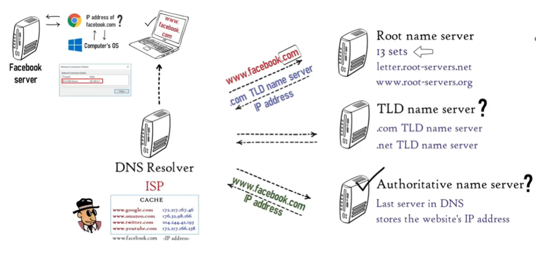
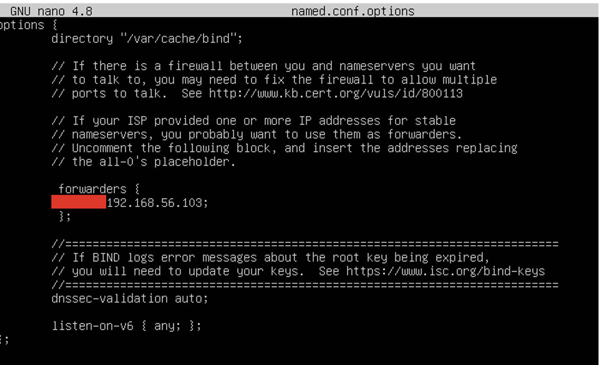
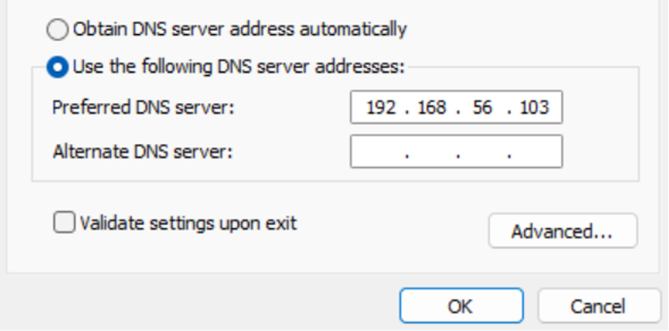

# DNS Server

## Practical Objectives

a.  Students are able to install a DNS Server.
b.  Students are able to modify the DNS Server configuration so that a server's IP address can be accessed using a custom domain name.

## Theoretical Background of DNS Server {#sec-theory-dns}

DNS (Domain Name System) is a distributed database system that maps host names, machine names, and domain names to IP addresses — and conversely maps IP addresses back to host names, a process known as **reverse mapping** [@mockapetris_dns_1987].

DNS acts as a bridge for two fundamental reasons:

-   Humans find it easier to remember names than 32-bit IP addresses.
-   Computers use IP addresses to communicate and interact over networks.

**How DNS works:**

1.  When a user types a URL or domain name into their browser, the browser queries the local DNS server connected to the network. If the local server does not have the answer, the request is forwarded up the DNS hierarchy.
2.  The DNS server searches for the record matching the requested domain name and returns the corresponding IP address to the browser.
3.  The browser uses that IP address to establish a connection to the target server.

::: {.callout-note title="Types of DNS Servers as illustrated @fig-dns" icon="false"}
-   **DNS Resolver** — the first point of contact; queries other servers on behalf of the client.
-   **Root Name Server** — the top of the DNS hierarchy; directs queries to the correct TLD server.
-   **TLD Name Server** — handles top-level domains such as `.com`, `.org`, or `.id`.
-   **Authoritative Name Server** — holds the actual DNS records for a domain and provides the final answer.
:::

{#fig-dns .lightbox fig-align="center" width="80%"}

## DNS Server Installation {#sec-steps-dns}

::: {.callout-important title="Before you begin"}
These steps assume Ubuntu Server is already installed, running, and reachable from the Windows host machine. If not, complete the Ubuntu Server installation practicum first.
:::

::: panel-tabset
## 1. Installation

**Step 1 — Find the Ubuntu Server IP address and test connectivity**

On Ubuntu Server, check the IP address:

``` bash
ip a  # <1>
```

1.  Note the IP address on the `enp0s8` adapter (e.g. `192.168.56.103`).

Then from Windows **Command Prompt**, ping that address and confirm you receive replies:

``` cmd
ping 192.168.56.103
```

**Step 2 — Confirm the domain name does not yet resolve**

Choose a domain name to use throughout this practicum (e.g. `yourdomain.com`). From Windows **Command Prompt**, ping it:

``` cmd
ping yourdomain.com
```

The expected output is:

```         
Ping request could not find host yourdomain.com.
Please check the name and try again.
```

This confirms no DNS record exists for the name yet.

**Step 3 — Install BIND9**

Back on Ubuntu Server, log in as root and update the package list:

``` bash
apt update
```

Install the BIND9 DNS server:

``` bash
apt-get install bind9  # <1>
```

1.  BIND9 (Berkeley Internet Name Domain) is the most widely used DNS server software on Linux.

Verify the installation:

``` bash
named -v           # <1>
systemctl status named
```

1.  Displays the BIND9 version; confirms the binary is installed correctly.

Allow BIND9 through the firewall:

``` bash
ufw allow bind9
```

## 2. DNS Configuration

**Step 4 — Configure forwarders in `named.conf.options`**

``` bash
cd /etc/bind/
nano named.conf.options
```

Find the `forwarders` block, remove the double slashes (`//`) to uncomment it, and enter your DNS forwarder address:

``` cfg
forwarders {
    8.8.8.8;
};
```

Save and exit, as shown in @fig-dns-forwarders.

{#fig-dns-forwarders .lightbox fig-align="center" width="80%"}

**Step 5 — Declare zones in `named.conf.local`**

``` bash
nano named.conf.local
```

Append the following two zone declarations at the end of the file:

``` cfg
zone "yourdomain.com" {
    type master;
    file "/etc/bind/db.yourdomain1";
};
 
zone "56.168.192.in-addr.arpa" {
    type master;
    file "/etc/bind/db.yourdomain2";
};
```

Save and exit.

**Step 6 — Copy the zone file templates**

``` bash
cp db.local db.yourdomain1  # <1>
cp db.127  db.yourdomain2   # <2>
```

1.  `db.local` is the template for a forward lookup zone.
2.  `db.127` is the template for a reverse lookup zone.

Verify both files were created:

``` bash
ls
```

**Step 7 — Edit the forward zone file (`db.yourdomain1`)**

``` bash
nano db.yourdomain1
```

Replace the relevant portion of the file with the following:

``` dns
@    IN   SOA   yourdomain.com.  root.yourdomain.com. (
                          2        ; Serial
                     604800        ; Refresh
                      86400        ; Retry
                    2419200        ; Expire
                     604800 )      ; Negative Cache TTL
;
@    IN   NS    yourdomain.com.
@    IN   A     192.168.56.103
www  IN   A     192.168.56.103
```

Save and exit.

**Step 8 — Edit the reverse zone file (`db.yourdomain2`)**

``` bash
nano db.yourdomain2
```

Replace the relevant portion of the file with the following:

``` dns
@    IN   SOA   yourdomain.com.  root.yourdomain.com. (
                          1        ; Serial
                     604800        ; Refresh
                      86400        ; Retry
                    2419200        ; Expire
                     604800 )      ; Negative Cache TTL
;
@    IN   NS    yourdomain.com.
103  IN   PTR   yourdomain.com.
```

Save and exit.

## 3. Network Setup

**Step 9 — Validate the configuration**

Check the BIND9 configuration syntax:

``` bash
named-checkconf  # <1>
```

1.  No output means no errors were found.

Validate each zone file:

``` bash
named-checkzone yourdomain.com /etc/bind/db.yourdomain1
named-checkzone 56.168.192.in-addr.arpa /etc/bind/db.yourdomain2
```

If no errors appear, the configuration is correct.

**Step 10 — Add the DNS server address to Netplan**

``` bash
nano /etc/netplan/01-netconf.yaml
```

Update the `enp0s8` section to include nameservers:

``` yaml
network:
  version: 2
  renderer: networkd
  ethernets:
    enp0s8:
      dhcp4: yes
      nameservers:
        addresses:
          - 8.8.8.8
          - 192.168.56.103  # <1>
```

1.  This tells the Ubuntu Server to use itself as the primary DNS resolver.

Apply the new network configuration:

``` bash
netplan apply
```

**Step 11 — Restart BIND9**

``` bash
service bind9 restart
```

**Step 12 — Configure the Windows network adapter DNS**

On Windows, open the network adapter settings for the **VirtualBox Host-Only Ethernet Adapter** that connects to your VM. Set the **Preferred DNS server** to the Ubuntu Server's IP address (e.g. `192.168.56.103`), as shown in @fig-win-dns-adapter.

{#fig-win-dns-adapter .lightbox fig-align="center" width="60%"}
:::

## Exercise {#sec-exercise-dns}

1.  Run the following commands from the **Ubuntu Server** terminal and observe the results:

``` bash
nslookup yourdomain.com      # <1>
nslookup 192.168.56.103      # <2>
dig yourdomain.com           # <3>
ping yourdomain.com
```

```{=html}
<!-- 1. Forward lookup — resolves the domain name to an IP address.
2. Reverse lookup — resolves the IP address back to a domain name.
3. Returns detailed DNS query information including record type, TTL, and response time. -->
```

2.  From the Windows machine, open a web browser and navigate to:

```         
http://yourdomain.com
```

If the Apache web server from the previous practicum is still running, the web page should load successfully — confirming that DNS resolution is working end-to-end.

3.  Based on your observations in Exercise 1, explain the function of each command:

> **Q1:** What information does `nslookup` return, and in what situations would you use it?

> **Q2:** What additional information does `dig` provide compared to `nslookup`?