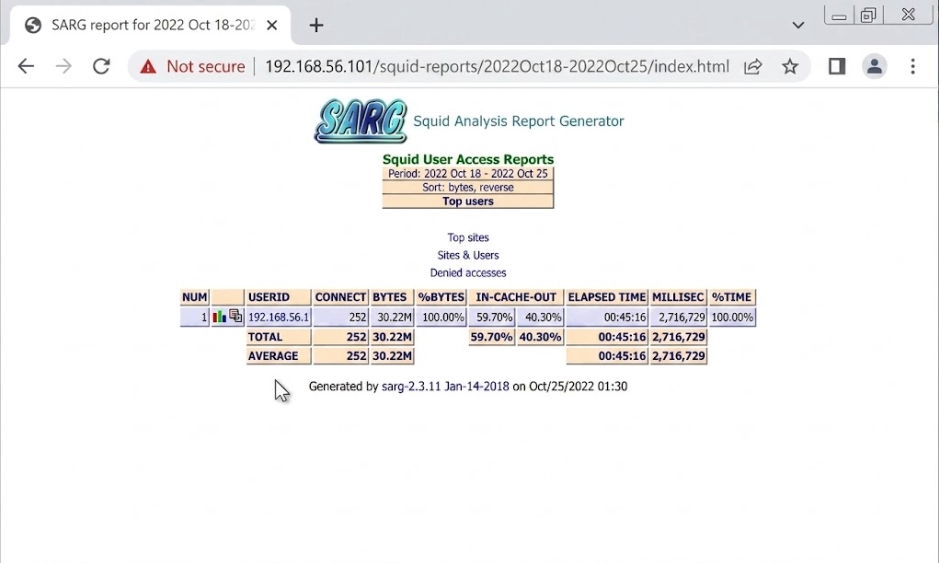

# SARG

## Practical Objectives

a.  Students are able to install SARG on Ubuntu Server.
b.  Students are able to configure SARG to generate web access reports from Squid proxy logs.
c.  Students are able to read and interpret SARG-generated reports via a web browser.

## Theoretical Background {#sec-theory-sarg}

SARG (Squid Analysis Report Generator) is an open-source tool that reads Squid proxy log files and produces detailed, human-readable HTML reports about network activity [@saive_sarg_2014]. Rather than parsing raw logs manually, SARG automates the analysis and presents the data in an organised, browsable format.

| Report Category | What It Shows |
|------------------------------------|------------------------------------|
| **Traffic Statistics** | Volume of requests and data transferred per user or site |
| **Top Sites** | Most frequently visited domains |
| **Access Time Patterns** | When users are most active on the network |
| **Bandwidth Usage** | Data consumption per user, site, or time period |
| **Error Reports** | Blocked requests, denied access events, and HTTP errors |

: SARG report categories {tbl-colwidths="\[30,70\]"}

Squid records all proxy activity to a log file — by default `/var/log/squid/access.log` — in a fixed columnar format that includes timestamp, response time, client IP, HTTP status, bytes transferred, and the requested URL [@squid_logs]. SARG reads this file and transforms it into the categorised reports above.

## Workflow SARG {#sec-workflow-sarg}

### SARG Installation {#sec-steps-sarg}

Log in to Ubuntu Server as root and update the package list:

``` bash
apt update
```

Install SARG:

``` bash
apt install sarg  # <1>
```

1.  SARG is available in the Ubuntu package repository; no additional PPA is required.

### SARG Configuration {#sec-config-sarg}

All SARG settings live in a single configuration file: `/etc/sarg/sarg.conf`. The steps below make three targeted edits to that file, then integrate SARG reports into Apache.

:::: panel-tabset
## Preparation

**Step 1 — Navigate to the SARG configuration directory**

``` bash
cd /etc/sarg/
```

**Step 2 — Back up the default configuration**

``` bash
cp sarg.conf sarg.conf.bak  # <1>
```

1.  Always back up before editing so you can restore the original if needed.

## Editing sarg.conf

**Step 3 — Open the configuration file**

``` bash
nano sarg.conf
```

Make the four edits in @tbl-sarg-conf, then save and exit.

| Line | Action | Before | After |
|------------------|------------------|------------------|------------------|
| 120 | Comment out | `output_dir /var/www/html/squid-reports` | `#output_dir /var/www/html/squid-reports` |
| 121 | Uncomment | `#output_dir /var/www/sarg` | `output_dir /var/www/sarg` |
| 132 | Set to `yes` | `resolve_ip no` | `resolve_ip yes` |
| 377 | Set charset | `#charset UTF-8` | `charset UTF-8` |

: Key edits in `sarg.conf` {#tbl-sarg-conf tbl-colwidths="\[8,20,36,36\]"}

::: {.callout-note title="What these settings do" icon="false"}
-   **Lines 120–121** redirect report output to `/var/www/sarg`, which Apache can serve directly.
-   **Line 132** (`resolve_ip yes`) attempts to resolve client IP addresses to hostnames in the report.
-   **Line 377** sets the HTML character encoding to UTF-8, ensuring correct rendering of non-ASCII characters.
:::

## Apache Integration

**Step 4 — Create the report output directory**

``` bash
mkdir /var/www/sarg
```

**Step 5 — Create the Apache configuration file for SARG**

``` bash
nano /etc/apache2/conf-available/sarg.conf
```

Enter the following content:

``` apache
Alias /squid-reports /var/www/sarg
 
<Directory /var/www/sarg>
    Options Indexes FollowSymLinks
    AllowOverride None
    Require all granted
</Directory>
```

Save and exit.

**Step 6 — Enable the configuration and reload Apache**

``` bash
a2enconf sarg          # <1>
systemctl reload apache2
```

1.  `a2enconf` creates a symlink from `conf-enabled/sarg.conf` to `conf-available/sarg.conf`, making the configuration active.
::::

## Exercise {#sec-exercise-sarg}

Complete the following steps in order. Steps 1–2 generate proxy log entries on the client; steps 3–5 set permissions and run SARG; step 6–7 view and interpret the results.

**Step 1 — Connect the client to the proxy**

On the client machine (Windows), configure the browser to use the Ubuntu Server IP address and port **3128** as the HTTP proxy (this is the Squid proxy configured in the previous practicum).

**Step 2 — Generate log entries**

Browse to several different websites from the client. These requests will be recorded in Squid's access log and will appear in the SARG report.

**Step 3 — Set permissions on the report directory**

Back on Ubuntu Server, grant write access to the SARG output directory:

``` bash
chmod 775 /var/www/sarg  # <1>
```

1.  SARG writes the HTML report files here; it needs write permission to do so.

**Step 4 — Set permissions on the Squid log**

``` bash
chmod 775 /var/log/squid/access.log  # <1>
```

1.  SARG reads this file; it needs read permission on the log.

**Step 5 — Run SARG to generate the report**

``` bash
/usr/bin/sarg  # <1>
```

1.  SARG reads `/var/log/squid/access.log`, processes all entries, and writes the HTML report to `/var/www/sarg`.

**Step 6 — View the report in a browser**

From the Windows machine, open a browser and navigate to:

```         
http://192.168.56.101/squid-reports/
```

A directory listing of report folders (organised by date) should appear, as shown in @fig-sarg-reports.

{#fig-sarg-reports .lightbox fig-align="center" width="60%"}

**Step 7 — Explore the report sections**

Open the most recent report folder and browse through the report. Identify the following sections and note what each one shows:

-   **TOP** — the most-visited websites during the report period
-   **USERS** — per-user activity breakdown
-   **SITES** — all sites accessed, with request counts and bytes transferred

> **Q:** Write a brief description of what you observed in each section based on the browsing activity you generated in Step 2.