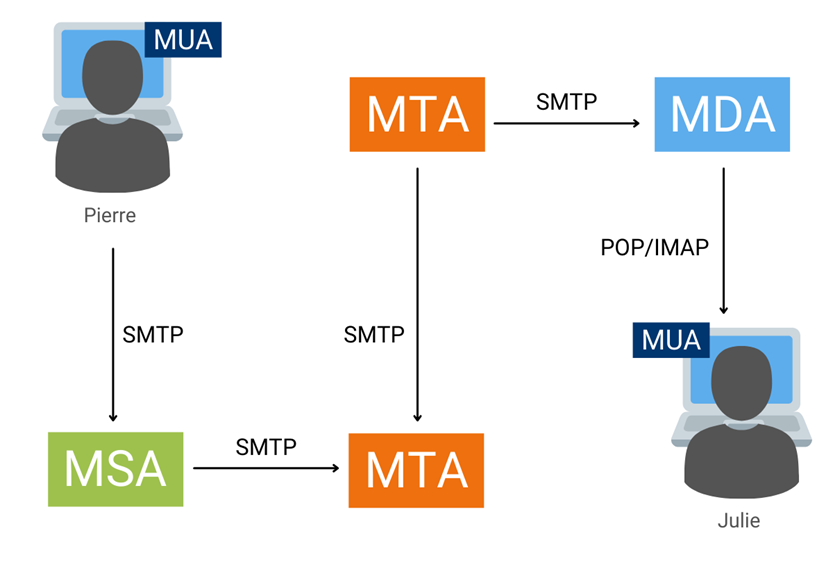

# Mail Server

## Practical Objectives

a.  Students are able to install a Mail Server using Postfix and Dovecot.
b.  Students are able to manage mail user accounts and demonstrate email delivery through the Mail Server.

## Theoretical Background {#sec-theory-mail}

A mail server is a system responsible for receiving, storing, and sending email over a computer network. It acts as the central hub for email exchange between senders and recipients.

**How email delivery works:**

1.  The user composes and sends a message using a mail client.
2.  The message travels from the user's host to the local mail server.
3.  The local mail server relays the message to the destination mail server over the internet.
4.  The destination mail server delivers the message to the recipient's mailbox.

### Email Agents

Three types of agents are involved in the email delivery process:

| Agent | Full Name | Role |
|------------------------|------------------------|------------------------|
| **MUA** | Mail User Agent | The mail client used by the user to compose and send email (e.g. Thunderbird, Outlook) |
| **MTA** | Mail Transfer Agent | The mail server that uses SMTP to relay messages between servers (e.g. Postfix) |
| **MDA** | Mail Delivery Agent | Retrieves incoming messages from the MTA and delivers them to the user's local mailbox |

@fig-email-agents is a diagram illustrating the three types of agents involved in the email delivery process. 

{#fig-email-agents width=600}

### Protocols

**SMTP** (Simple Mail Transfer Protocol) is the standard protocol for sending email between mail servers [@rfc5321_smtp]. Key characteristics:

-   Uses **port 25** by default; port **587** is commonly used for authenticated client submission.
-   Requires username and password authentication to send mail through a relay server.

**POP3 and IMAP** are the two protocols used to retrieve email from a mail server:

| Feature | POP3 | IMAP |
|------------------------|------------------------|------------------------|
| Storage | Email downloaded to device; removed from server | Email stays on server |
| Multi-device access | Not ideal — email lives on one device | Yes — synced across all devices |
| Offline access | Yes, after downloading | Limited to cached content |
| Folder synchronization | No | Yes |
| Default port | 110 | 143 |

POP3 suits users who want to download email once and read it offline. IMAP suits users who need to access their mailbox from multiple devices with full synchronization.

## Mail Server Installation {#sec-steps-mail}

::: panel-tabset
## 1.   Preparation

**Step 1 — Log in as root and update**

``` bash
apt-get update
```

**Step 2 — Check the current hostname**

``` bash
hostnamectl status
```

Note the existing hostname — you will need to replace it in `/etc/hosts` in Step 4.

**Step 3 — Set the mail server hostname**

``` bash
hostnamectl set-hostname mail.example.com
```

**Step 4 — Update `/etc/hosts`**

``` bash
nano /etc/hosts
```

On line 2, replace the old IP address and hostname with your Ubuntu Server's IP address and the new hostname set in Step 3:

```         
192.168.56.103   mail.example.com
```

Save and exit.

**Step 5 — Reboot**

``` bash
reboot
```

## 2.   Postfix Setup

**Step 1 — Install Postfix, Dovecot, and supporting packages**

After rebooting, log back in as root, then run:

``` bash
apt -y install postfix sasl2-bin dovecot-core dovecot-pop3d dovecot-imapd mailutils  # <1>
```

1.  When the package configuration prompt appears, select **No Configuration** — Postfix will be configured manually in the next steps.

**Step 2 — Copy the Postfix configuration template**

``` bash
cp /usr/share/postfix/main.cf.dist /etc/postfix/main.cf
```

**Step 3 — Edit `main.cf`**

``` bash
nano /etc/postfix/main.cf --linenumbers  # <1>
```

1.  The `--linenumbers` flag displays line numbers in the editor. Use <kbd>Ctrl</kbd>+<kbd>W</kbd> to search for a line's content.

Apply the edits in @tbl-maincf. Replace `192.168.56.103` with your actual Ubuntu Server IP address where applicable.

| Line | Action | Value |
|-----------------------:|------------------------|------------------------|
| 82 | Uncomment | `mail_owner = postfix` |
| 98 | Uncomment & edit | `myhostname = mail.example.com` |
| 106 | Uncomment & edit | `mydomain = example.com` |
| 127 | Uncomment | `myorigin = $mydomain` |
| 141 | Uncomment | `inet_interfaces = all` |
| 189 | Uncomment | `mydestination = $myhostname, localhost.$mydomain, localhost, $mydomain` |
| 232 | Uncomment | `local_recipient_maps = unix:passwd.byname $alias_maps` |
| 277 | Uncomment | `mynetworks_style = subnet` |
| 294 | Add server IP | `mynetworks = 127.0.0.0/8, 192.168.56.103/24` |
| 416 | Uncomment | `alias_maps = hash:/etc/aliases` |
| 427 | Uncomment | `alias_database = hash:/etc/aliases` |
| 449 | Uncomment | `home_mailbox = Maildir/` |
| 585 | Comment out | `#smtpd_banner = $myhostname ESMTP $mail_name (Ubuntu)` |
| 586 | Add below 585 | `smtpd_banner = $myhostname ESMTP` |
| 659 | Add | `sendmail_path = /usr/sbin/postfix` |
| 664 | Add | `newaliases_path = /usr/bin/newaliases` |
| 669 | Add | `mailq_path = /usr/bin/mailq` |
| 675 | Add | `setgid_group = postdrop` |
| 679 | Comment out | `#html_directory =` |
| 683 | Comment out | `#manpage_directory =` |
| 688 | Comment out | `#sample_directory =` |
| 692 | Comment out | `#readme_directory =` |
| 693 | Set to ipv4 | `inet_protocols = ipv4` |

: Edits to `/etc/postfix/main.cf` {#tbl-maincf tbl-colwidths="\[8,20,72\]"}

At the **end of the file**, append the following block:

``` cfg
message_size_limit = 10485760
mailbox_size_limit = 1073741824
 
# SMTP-Auth settings
smtpd_sasl_type = dovecot
smtpd_sasl_path = private/auth
smtpd_sasl_auth_enable = yes
smtpd_sasl_security_options = noanonymous
smtpd_sasl_local_domain = $myhostname
smtpd_recipient_restrictions = permit_mynetworks, permit_auth_destination, permit_sasl_authenticated, reject
```

Save and exit.

**Step 4 — Rebuild the alias database**

``` bash
newaliases
```

## 3.   Dovecot Setup

**Step 5 — Edit `dovecot.conf`**

``` bash
nano /etc/dovecot/dovecot.conf --linenumbers
```

At line 30, uncomment:

``` cfg
listen = *, ::
```

Save and exit.

**Step 6 — Edit `10-auth.conf`**

``` bash
nano /etc/dovecot/conf.d/10-auth.conf --linenumbers
```

| Line | Change                                                   |
|------|----------------------------------------------------------|
| 10   | Uncomment and set to `no`: `disable_plaintext_auth = no` |
| 100  | Set to: `auth_mechanisms = plain login`                  |

Save and exit.

**Step 7 — Edit `10-mail.conf`**

``` bash
nano /etc/dovecot/conf.d/10-mail.conf --linenumbers
```

At line 30, change to:

``` cfg
mail_location = maildir:~/Maildir
```

Save and exit.

**Step 8 — Edit `10-master.conf`**

``` bash
nano /etc/dovecot/conf.d/10-master.conf --linenumbers
```

At lines 109–112, uncomment the `unix_listener` block and add the user and group:

``` cfg
# Postfix smtp-auth
unix_listener /var/spool/postfix/private/auth {
  mode = 0666
  user = postfix
  group = postfix
}
```

Save and exit.

**Step 9 — Restart services and verify**

``` bash
systemctl restart dovecot postfix
systemctl status dovecot postfix
```

Confirm that Dovecot shows **`active (running)`** and Postfix shows **`active (exited)`**.
:::

## Exercise {#sec-exercise-mail}

::: panel-tabset
## Add Mail User

**Step 1 — Set the mail environment variable**

``` bash
echo 'export MAIL=$HOME/Maildir/' >> /etc/profile.d/mail.sh  # <1>
```

1.  This ensures the `mail` command knows where to look for each user's mailbox.

**Step 2 — Note the existing username**

Run the following to see the current user accounts on the system:

``` bash
cat /etc/passwd | grep home  # <1>
```

1.  Identify your primary Ubuntu user account (e.g. `alam`). This will be the email recipient in the next exercise.

**Step 3 — Add a new user**

``` bash
adduser ubuntu  # <1>
```

1.  Follow the prompts to set a password. Leave Full Name, Room Number, and other fields blank by pressing <kbd>Enter</kbd>.

After the user is created, reboot the server:

``` bash
reboot
```

## Send Test Email

**Step 4 — Send an email from the new user**

After rebooting, switch to the new user account:

``` bash
su ubuntu
```

Send an email to the original user (e.g. `alam`):

``` bash
mail alam@localhost
```

Follow the prompts:

-   **Cc:** press <kbd>Enter</kbd> to skip.

-   **Subject:** type a subject, e.g. `Test email 1`, then press <kbd>Enter</kbd>.

-   **Body:** type the email body, e.g.:

    ```         
    This is the first test email.
    Thank you.
    ```

-   Press <kbd>Ctrl</kbd>+<kbd>D</kbd> to finish and send.

**Step 5 — Switch back to the original user**

``` bash
exit   # <1>
```

1.  If you are still in the root shell, type `exit` a second time to return to the original user account. A notification should appear indicating that new mail has arrived.

**Step 6 — Read the email**

Open the mailbox:

``` bash
mail
```

Type the message number (e.g. `1`) and press <kbd>Enter</kbd> to read it. Type `q` and press <kbd>Enter</kbd> to quit.
:::